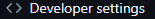

All private registries will be treated the same but the below are examples I've done for my cluster.

# ghcr.io private registry
* For github details, refer to their [guide](https://docs.github.com/en/packages/working-with-a-github-packages-registry/working-with-the-container-registry) on how to setup your private registry for pushing and pulling.
* For Coder and k3s, a user created a guide and you can view it [here](https://coder.com/docs/guides/image-pull-secret).

Now, I will try to make a step by step (with pictures) so you can get a TLDR of the whole process; details are above and, of course, I am parrotting other peoples work.

### Github Setup
1. You will need to setup Github with a personal token for pushing and pulling. Begin with navigating to your profile icon in the top right and finding the . 

2. Focus your attention on the left side now, and find the  at the bottom of the list.

3. Under Personal access tokens, find 'Tokens (classic)' and click 'Generate new token' and finally click 'Generate new token (classic)'.

4. Enter a logical note for future reference (I used 'Container Registry all Permissions') and select 'write:packages' (at minimum) and 'delete:packages' (optional). Click 'Generate token' at the bottom of the page.

This creates a token with write permissions to your registry (so you push from your local docker registry) and read permissions (so your k3s can pull from the registry). Modify the permissions to your liking at this step. So for example, if you wanted to only allow k3s to read from the registry then you would no use 'write:packages' but you would provide 'read:packages' instead. You won't be able to use this token as a push token BUT you can use github actions to do that on your behalf (which isn't covered here today).

5. Copy the token that is shown after generating the token and place it somewhere safe; like a sticky note taped to your monitor... I'm kidding... stop doing that.. I used my bitwarden vault to store it. 

### Kubernetes Setup
1. Create a json file describing your ghcr.io registry access. Here is a template to use but note that a few items encapsulated '< >' need to be replaced with items unique to your setup. I saved this file as 'ghcr.io.json' but you can name it whatever you please. If you use something different, step two will need to use that file name you choose which will replace the 'ghcr.io.json'.

```json
{
  "auths": {
    "ghcr.io": {
      "username": "<github-username-or-organization-name",
      "password": "<token-generated-above>"
    }
  }
}

```
2. Follow the command below to create the secret in your namespace of your choice. Since I deployed Coder in 'coder' namespace and all my workspaces are spun up in 'coder' namespace as well, I had to place the secret holding my token in 'coder' namespace.

```bash
kubectl create secret generic regcred \
  --from-file=.dockerconfigjson=ghcr.io.json \
  --type=kubernetes.io/dockerconfigjson \
  --namespace=coder
```

### Coder Template Setup

Luckily, you're almost out of the woods. Now you just need to add an entry and section to your terraform template file and you're golden. In your template terraform file, find the section that defines your kubernetes deployment template configuration. It could look different from others but the structure (as of today 20 JUL 2024) will resemble the file structure of a deployment manifest file. This means, look for a 'template' which holds an object called 'spec'. For my, my 'container' is described at that level and thus I placed the below piece of code.

```terraform
image_pull_secrets {
    name = "regcred"
}
```

If you used a different secret name than 'regcred' make sure to update that. 

Here is a more complete (but not complete definition) example where the 'image_pull_secrets' is added but also an image using my custom Golang environment docker image.

```terraform
...

    template {
        metadata {
        labels = {
            "app.kubernetes.io/name" = "coder-workspace"
        }
        }
        spec {
        security_context {
            run_as_user = 1000
            fs_group    = 1000
        }
        image_pull_secrets {
            name = "regcred"
        }
        container {
            name              = "cpp-builder"
            image             = "ghcr.io/markbrown87/golang-env:1.0.0"
            image_pull_policy = "Always"
            command           = ["sh", "-c", coder_agent.main.init_script]
            security_context {
            run_as_user = "1000"
            }

...
```